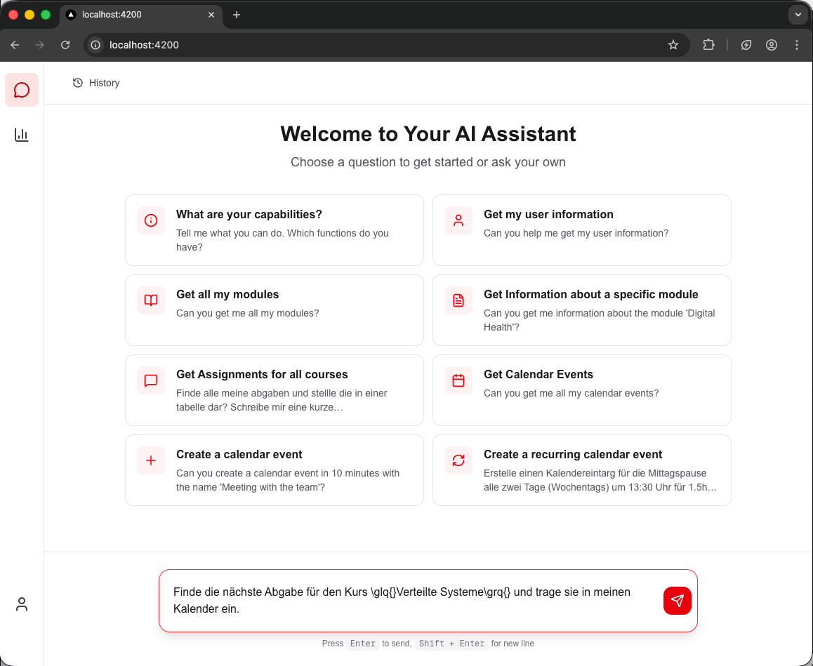
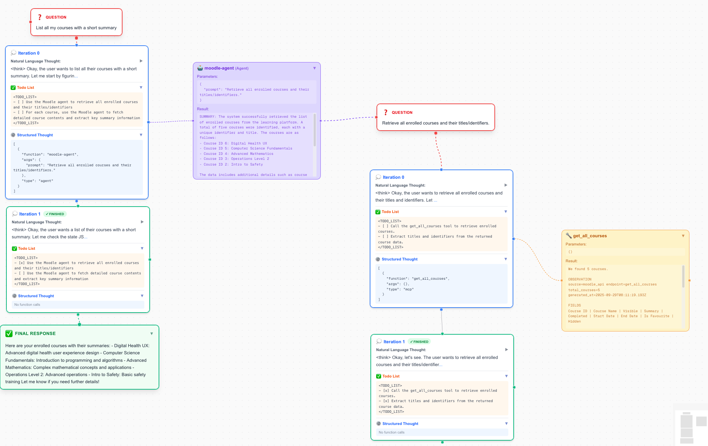

# Agentic AI: Intelligent Study Assistant

> **Thesis Title:** _Agentic AI: Conception and Prototypical Implementation of an Intelligent Study Assistant Based on a Large Language Model_
>
> **Original Title (German):** _Agentic AI: Konzeption und prototypische Umsetzung eines intelligenten Studienassistenten auf Basis eines Large Language Models_

This repository contains the conception and functional prototype of an intelligent study assistant, developed as part of a Master's thesis at **Hochschule Düsseldorf (HSD)**. The system uses a local **multi-agent architecture** to autonomously support student workflows such as deadline management and course organization.

## 🌟 Key Features

- **Privacy-by-Design**: The system operates entirely locally on consumer hardware (e.g., RTX 4090), ensuring sensitive data such as grades and appointments never leave your own infrastructure.

- **Multi-Agent Orchestration**: A central **Routing Agent** decomposes complex tasks and delegates them to specialized sub-agents for Moodle and calendar services.

- **Standardized Interoperability**: Uses the **Model Context Protocol (MCP)** for tool integration and the **Agent2Agent (A2A)** protocol for communication between autonomous agents.

- **High-Performance Inference**: Utilizes the **vLLM engine** with **PagedAttention** for highly efficient memory management and parallel request processing.

---

## 🏗 System Architecture

The system follows a hierarchical microservice structure that strictly separates cognitive planning from technical execution.

- **Routing Agent**: Acts as an orchestrator and uses the **ReAct paradigm** (Reasoning + Acting) to solve tasks step by step.

- **Tool Agents (Moodle/Calendar)**: Encapsulate domain-specific logic and perform independent "sub-reasoning" (e.g., resolving course names to IDs).

- **MCP Servers**: Provide a standardized abstraction layer for technical access to external APIs such as Moodle or Google Calendar.

---

## 🖥 User Interface



---

## 📋 Prerequisites

Before setting up the project, ensure your environment meets the following requirements:

- **Hardware**: An NVIDIA GPU with sufficient VRAM (e.g., RTX 4090) is required to support the local inference of the Qwen3-4B model via the vLLM engine.

- **Containerization**: Docker and Docker Compose are necessary to orchestrate the distributed microservice architecture.

- **Node.js**: Version 22+ is used for the backend logic and the Next.js frontend.

- **pnpm**: The project uses pnpm for efficient package management within the Nx monorepo.

- **Python**: Required for executing the semantic evaluation pipeline and metrics analysis using the DeepEval framework.

- **Moodle Access**: A valid Webservice Token is required for course and assignment retrieval.

- **Google Calendar Access**: Configured OAuth2 credentials are required for managing calendar events.

---

## 🛠 Technology Stack

- **Frontend**: Next.js with real-time visualization of the reasoning process via Server-Sent Events (SSE).

- **Backend**: Node.js & TypeScript within an **Nx Monorepo**.

- **AI Model**: **Qwen3-4B** (Small Language Model), optimized for local execution.

- **Validation**: Strict runtime validation of all data structures using **Zod**.

---

## 🚀 Installation & Setup

### 1. Preparation

Install dependencies and copy the example configuration file:

```bash
pnpm i
cp .env.example .env
```

Enter your API keys and tokens in the `.env` file.

### 2. Network Configuration (Local Development)

To access the locally hosted Moodle instance, an entry must be added to the `hosts` file:

- **Entry**: `127.0.0.1  moodle`
- Moodle will then be accessible via `http://moodle`.

### 3. Start System

Starts the entire agent system along with a local Moodle instance:

```bash
bash scripts/start-docker.sh
```

### 4. End-to-End Tests

Starts the system including **WireMock** to simulate the Moodle and Google Calendar APIs:

```bash
bash scripts/start-docker.sh test
```

---

## 🧪 Testing

Run tests for individual components:

```bash
# End-to-End tests
pnpm test:e2e

# Agent Framework unit tests
pnpm test:agent-framework

# Moodle Agent unit tests
pnpm test:moodle-agent

# Moodle Agent E2E tests
pnpm test:moodle-agent:e2e
```

---

## 📊 Evaluation & Research Findings

A quantitative ablation study examined the impact of explicit planning modules on Small Language Models (SLMs).

- **Results**: An explicit TODO list led to a performance drop of **10.7 percentage points** compared to the baseline (56.0% vs. 45.3% pass rate).

- **Inverse Scaling**: The more complex the context becomes through planning patterns, the more the precision of smaller models decreases.

- **Conclusion**: For local agent systems based on SLMs, a **"Less is More"** strategy in prompt engineering is more effective than complex planning patterns from larger models.

### Running Evaluation Manually:

```bash
pnpm run test:evaluation
# Start analysis script
cd evaluation
source venv/bin/activate && pip install -r requirements.txt && python evaluate_experiments.py
```

---

## 🔍 Transparent Open Glass Approach

The frontend provides a transparent "open glass" view into the agent's reasoning process. Users can observe in real-time how the system decomposes tasks, delegates to sub-agents, and executes tool calls. This makes the decision-making process fully transparent and comprehensible.



---

## 👨‍💻 Author

**[Malte Sehmer](https://www.linkedin.com/in/malte-sehmer/)**, Hochschule Düsseldorf

Submission Date: December 23, 2025
